# 🚗 Car Rental App (Angular)

## A Coding Factory @ AUEB Final Project. Angular - Typescript - Car Rental Application frontend.

## Description

This project is a Car Rental Application developed with Angular (CLI 19.0.3) for the frontend and Spring Boot for the [backend](https:///README.md). It showcases modern web development practices, utilizing modular design, routing, services, and a component-based architecture.

## 🎯 Project Overview
The Car Rental App is designed to create a peer-to-peer car rental marketplace.
-Users can list their cars for rent, manage their availability, and update details through a personalized garage.
-Other users can browse and rent cars available in the system.
-Administrators have access to a restricted area to manage users, car data, and system configurations.

## ✨ Key Features
-Garage Management
  -Users can add their car(s) to a virtual garage.
  -Upload car photos and manage car details (update, delete, or mark unavailable).

-Car Browsing & Booking
  -View all available cars listed by other users.
  -Search and filter cars by brand, model, or city.

-Admin Panel
  -Admins can:
    -Manage Users – Update roles, deactivate accounts, or delete users.
    -Manage Car Data – Add car brands, models, and cities.

---

## 🖥️ Screenshots

<table>
  <tr>
    <td>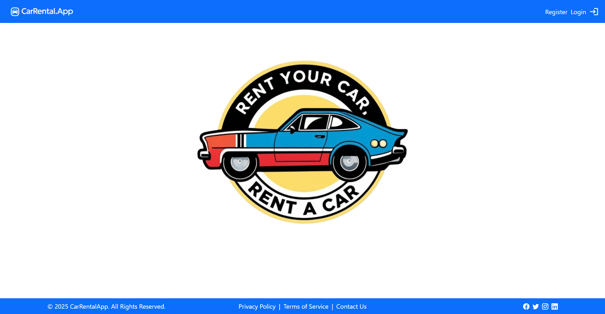</td>
    <td>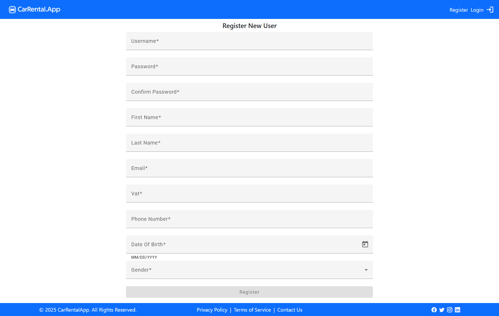</td>
  </tr>
  <tr>
    <td>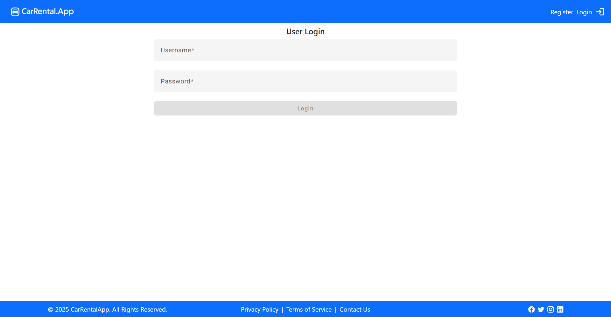</td>
    <td>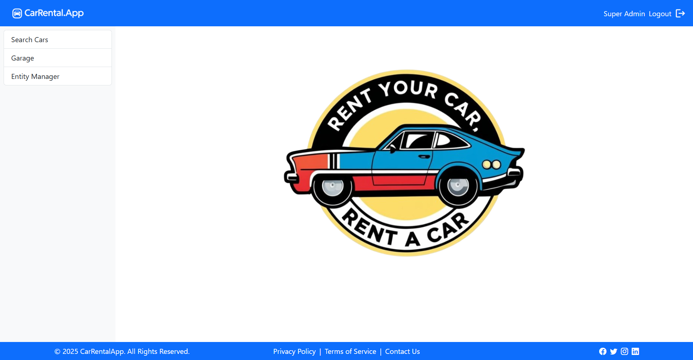</td>
  </tr>
  <tr>
    <td>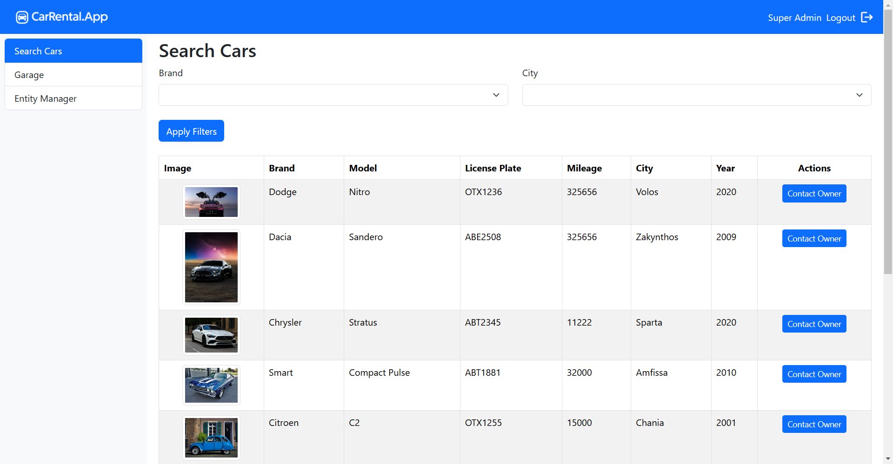</td>
    <td>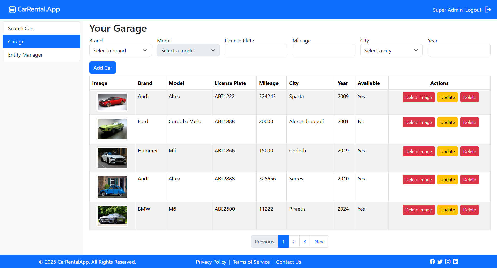</td>
  </tr>
  <tr>
    <td>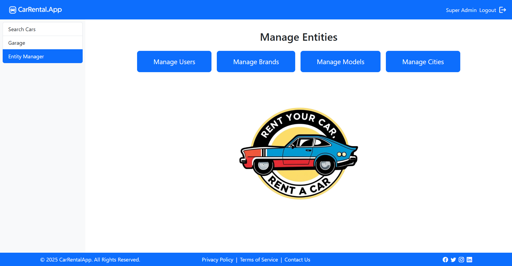</td>
    <td></td>
  </tr>
  <tr>
    <td>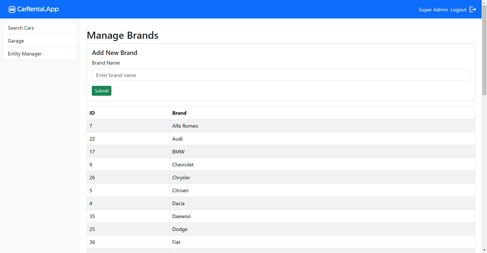</td>
    <td>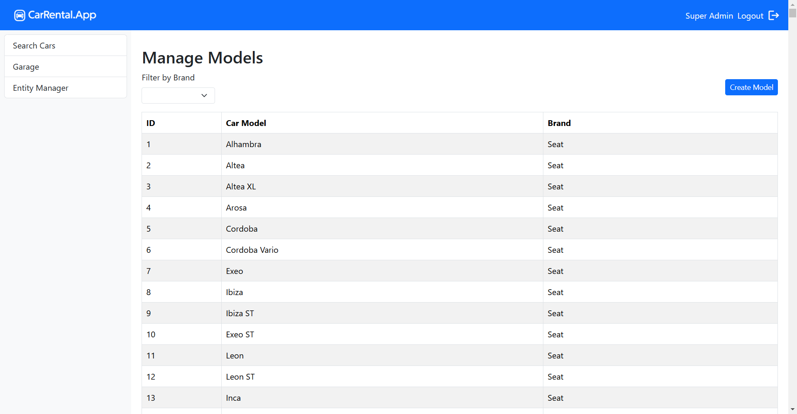</td>
  </tr>
  <tr>
    <td>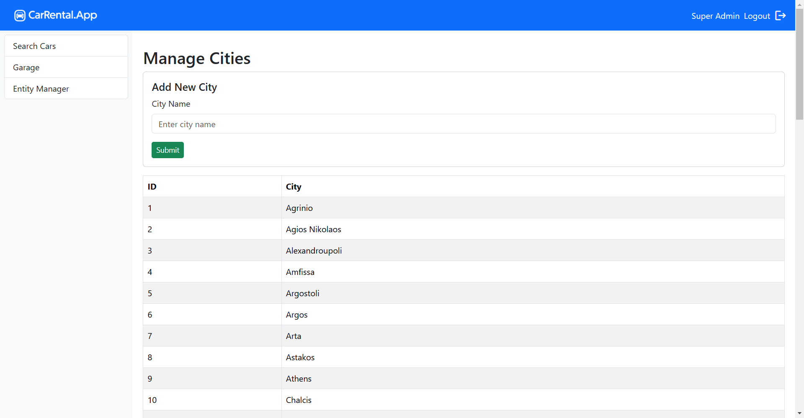</td>
    <td>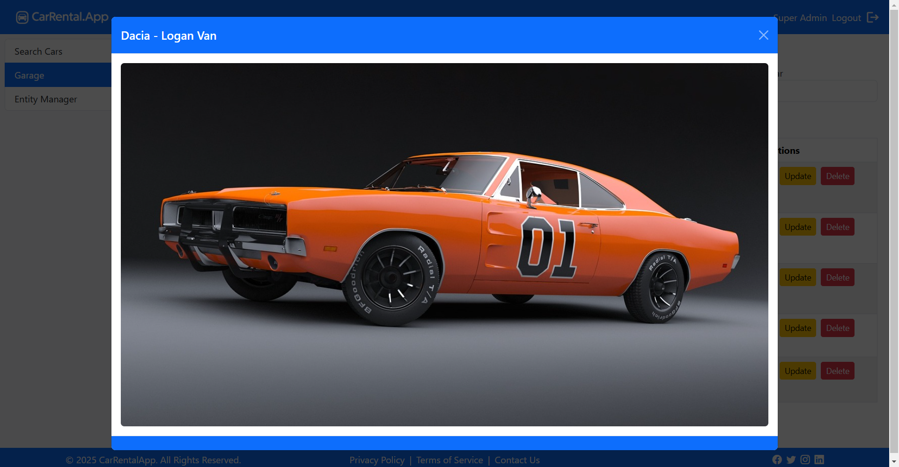</td>
  </tr>
</table>

---

## 🔧 Technology Stack
-Frontend: Angular 19.0.3 (Dynamic UI, Routing, and Component-based architecture)
-Backend: Spring Boot (REST API)
-Database: PostgreSQL or MySQL (configurable)
-Authentication: JWT (JSON Web Tokens) for secure login and role management

## 🚀 Getting Started

### Prerequisites
Ensure you have the following installed:
- **Node.js (v19 or higher)** – [Download Node.js](https://nodejs.org/)
- **Angular CLI** – Install via:
```bash
npm install -g @angular/cli
```

---

### ⚙️ Development Server
Run the following command to start the development server:
```bash
ng serve
```
Navigate to [http://localhost:4200/](http://localhost:4200/). The application will automatically reload if you change any of the source files.

---

### 🛠️ Code Scaffolding
Generate new components, services, or other Angular elements using the Angular CLI:
```bash
ng generate component component-name
ng generate directive|pipe|service|class|guard|interface|enum|module
```

---

### 🏗️ Building the Project
To build the project, run:
```bash
ng build
```
The build artifacts will be stored in the `dist/` directory.

---

## 📂 Project Structure
```
src/
├── app/                          # Main Angular application
│   ├── components/               # UI components
│   ├── shared/                   # Shared logic (guards, interfaces, services)
│   ├── app.component.ts          # Root component
│   ├── app.routes.ts             # App routing
│   └── app.config.ts             # App configuration
│
├── assets/                        
│   └── images/                   # Static assets (logos, icons)
│
├── index.html                    # Main entry point
├── main.ts                       # Bootstrap logic
└── styles.css                    # Global styles
```

---

## 🌐 Deployment

To deploy the application, follow these steps:
1. Build the production version:
```bash
ng build --prod
```
2. Deploy the contents of the `dist/` folder to your preferred web server or hosting platform (e.g., Netlify, Vercel, AWS S3).

Example (Netlify):
```bash
netlify deploy --prod
```

---

## 📄 Environment Configuration
Set up environment variables for different stages (development, production). Modify files in:
```
src/environments/
├── environment.ts                # Development settings
└── environment.prod.ts           # Production settings
```

---

## 📧 Contact
For questions or feedback, feel free to reach out:
- **Name**: Zarkadis Petros
- **Email**: petros.zark@hotmail.com

---

### 📦 Example Data
- **Admin User**: SuperAdmin / Sa123456!
- **API URL**: http://localhost:8080/api

---
